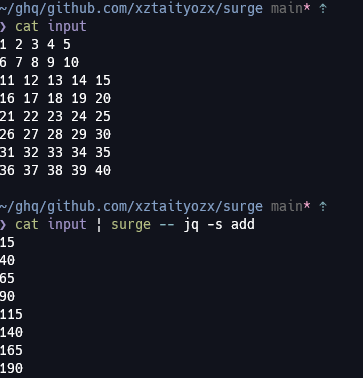

# ⚡surge⚡

`surge` is high performance `while read L; do echo "$L" | some_command | tr '\n' ' '; done` shorthand



# Usage

```
surge 0.1.0
xztaityozx
high performance while read L; do echo $L | some-command | paste -sd ' '; done shorthand

USAGE:
    surge [OPTIONS] <COMMAND> [ARGUMENTS]...

ARGS:
    <COMMAND>         command
    <ARGUMENTS>...    arguments for command

OPTIONS:
        --completion <SHELL>
            generate completion script (bash,zsh,fish,powershell)

    -d, --input-delimiter <INPUT_DELIMITER>
            delimiter for input [default: " "]

    -D, --output-delimiter <OUTPUT_DELIMITER>
            delimiter for output [default: " "]

    -g, --regex <REGEX>
            split by regex

    -h, --help
            Print help information

    -P, --number-of-parallel <NUMBER_OF_PARALLEL>
            maximum number of parallels [default: 1]

        --suppress-fail
            continue other process even if one of the sub process fails

    -V, --version
            Print version information
```

# Example

```sh
# sum each line
$ seq 100 | paste -d ' ' - - - - | surge -- numsum
10
26
42
58
74
90
106
122
138
154
170
186
202
218
234
250
266
282
298
314
330
346
362
378
394
```

# Install

## manual build
```
$ git clone https://github.com/xztaityozx/surge
$ cd surge
$ cargo install --path .
```

# TODO
- [ ] write unit test
- [x] generate shell completion script
- [ ] create release

